合成資料品質評估器，提供隱私風險指標、資料品質評估與機器學習效用分析。

## 完整類別架構圖

```mermaid
classDiagram
    class Evaluator {
        <<main>>
        +__init__(method: str, **kwargs)
        +create() void
        +eval(data: dict) dict[str, DataFrame]
        +config: EvaluatorConfig
    }

    class AnonymeterEvaluator {
        <<subclass>>
        +eval(data: dict) dict[str, DataFrame]
        -_evaluate_singlingout()
        -_evaluate_linkability()
        -_evaluate_inference()
    }

    class SDMetricsEvaluator {
        <<subclass>>
        +eval(data: dict) dict[str, DataFrame]
        -_diagnostic_report()
        -_quality_report()
    }

    class MLUtilityEvaluator {
        <<subclass>>
        +eval(data: dict) dict[str, DataFrame]
        -_classification()
        -_regression()
        -_clustering()
    }

    class MLUtilityV2Evaluator {
        <<subclass>>
        +eval(data: dict) dict[str, DataFrame]
        -_preprocess_data()
        -_evaluate_classification()
        -_evaluate_regression()
        -_evaluate_clustering()
    }

    class StatsEvaluator {
        <<subclass>>
        +eval(data: dict) dict[str, DataFrame]
        -_compute_stats()
    }

    class CustomEvaluator {
        <<subclass>>
        +eval(data: dict) dict[str, DataFrame]
        +module_path: str
        +class_name: str
    }

    class EvaluatorConfig {
        <<dataclass>>
        +method: str
        +method_code: str
        +params: dict
    }

    %% 繼承關係
    Evaluator <|-- AnonymeterEvaluator : extends
    Evaluator <|-- SDMetricsEvaluator : extends
    Evaluator <|-- MLUtilityEvaluator : extends
    Evaluator <|-- MLUtilityV2Evaluator : extends
    Evaluator <|-- StatsEvaluator : extends
    Evaluator <|-- CustomEvaluator : extends
    
    %% 組合關係
    Evaluator *-- EvaluatorConfig : contains

    %% 樣式標示
    style Evaluator fill:#e6f3ff,stroke:#4a90e2,stroke-width:3px
    style AnonymeterEvaluator fill:#fff2e6,stroke:#ff9800,stroke-width:2px
    style SDMetricsEvaluator fill:#fff2e6,stroke:#ff9800,stroke-width:2px
    style MLUtilityEvaluator fill:#fff2e6,stroke:#ff9800,stroke-width:2px
    style MLUtilityV2Evaluator fill:#fff2e6,stroke:#ff9800,stroke-width:2px
    style StatsEvaluator fill:#fff2e6,stroke:#ff9800,stroke-width:2px
    style CustomEvaluator fill:#fff2e6,stroke:#ff9800,stroke-width:2px
    style EvaluatorConfig fill:#f0f8ff,stroke:#6495ed,stroke-width:2px
```



> **圖例說明：**
> - 藍色框：主要類別
> - 橘色框：子類別實作
> - 淺藍框：配置類別
> - `<|--`：繼承關係 (inheritance)
> - `*--`：組合關係 (composition)

## 基本使用

```python
from petsard import Evaluator

evaluator = Evaluator(method='sdmetrics-qualityreport')
evaluator.create()
result = evaluator.eval({
    'ori': original_data,
    'syn': synthetic_data
})
```

## 主要方法

### __init__(method, **kwargs)
初始化評估器，根據方法名稱和參數建立對應的評估器實例。

### create()
建立並初始化內部評估器。

### eval(data)
執行評估並返回結果。

**參數**：
- `data` (`dict`): 包含原始資料、合成資料和控制資料的字典
  - `ori`: 原始訓練資料
  - `syn`: 合成資料
  - `control`: 控制/測試資料（可選）

**返回**：
- `dict[str, pd.DataFrame]`: 評估結果字典

## 評估結果格式

所有評估器都返回 `dict[str, pd.DataFrame]` 格式的結果：

- **global**: 整體評估結果（單列 DataFrame）
- **columnwise**: 欄位層級評估（每列代表一個欄位）
- **pairwise**: 欄位對評估（每列代表一對欄位）
- **details**: 詳細資訊（格式依評估方法而異）