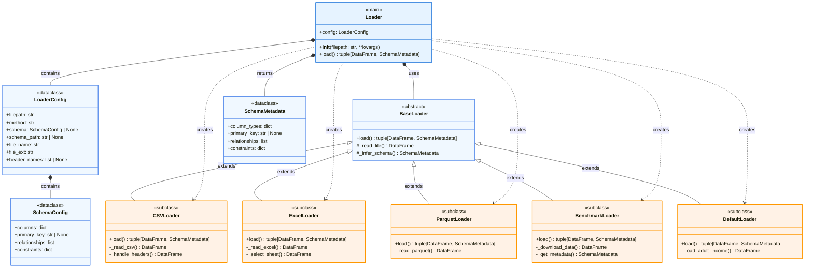

資料載入模組，支援多種檔案格式與 benchmark 資料集載入。

## 完整類別架構圖



> **圖例說明：**
> - 藍色框：主要類別
> - 橘色框：子類別實作
> - 淺藍框：配置與資料類別
> - `<|--`：繼承關係 (inheritance)
> - `*--`：組合關係 (composition)
> - `..>`：依賴關係 (dependency)

## 基本使用

```python
from petsard import Loader

# 載入 CSV 檔案
loader = Loader('data.csv')
data, schema = loader.load()

# 載入 benchmark 資料集
loader = Loader('benchmark://adult-income')
data, schema = loader.load()

# 使用自訂 schema
loader = Loader('data.csv', schema='schema.yaml')
data, schema = loader.load()
```

## 主要方法

### __init__(filepath, **kwargs)
初始化載入器，根據檔案路徑或方法建立對應的載入器實例。

### load()
載入資料並返回 DataFrame 與 SchemaMetadata。

**返回**：
- `data` (`pd.DataFrame`): 載入的資料表
- `schema` (`SchemaMetadata`): 資料結構詮釋資料

## 支援的檔案格式

- **CSV**: `.csv`, `.tsv`
- **Excel**: `.xlsx`, `.xls`
- **Parquet**: `.parquet`
- **Benchmark**: `benchmark://dataset_name`
- **Default**: 使用 `method='default'` 載入預設資料集

## Schema 配置

Schema 可透過以下方式提供：

1. **自動推論**：不提供 schema 參數時自動推論
2. **YAML 檔案**：提供 schema YAML 檔案路徑
3. **字典配置**：直接提供 schema 字典
4. **SchemaConfig 物件**：使用 SchemaConfig 類別

## 載入結果格式

所有載入器都返回一致的格式：

- **data**: pandas DataFrame 格式的資料表
- **schema**: SchemaMetadata 物件，包含：
  - `column_types`: 欄位類型定義
  - `primary_key`: 主鍵欄位
  - `relationships`: 資料關聯
  - `constraints`: 資料約束條件