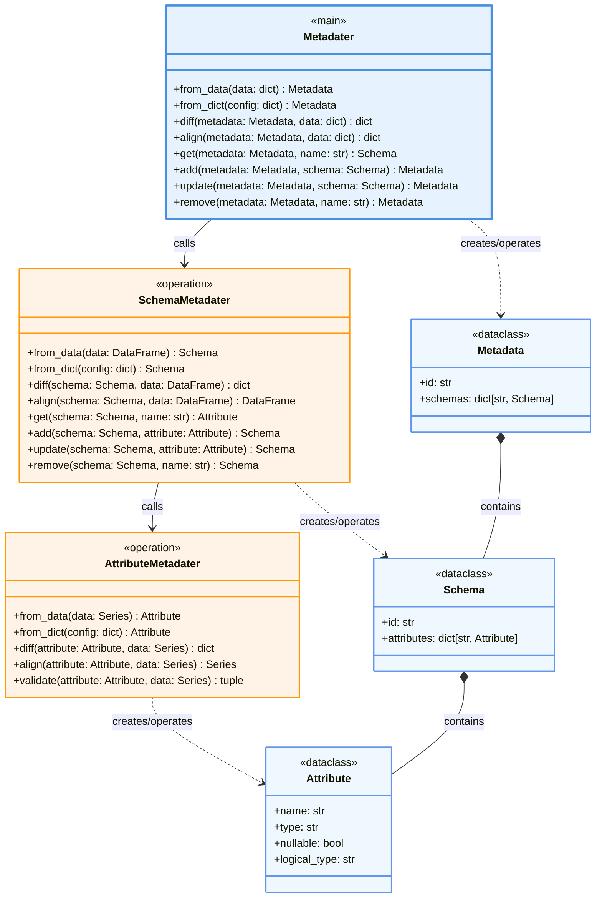

資料結構描述管理器，提供資料集的詮釋資料定義與管理功能。

## 類別架構圖



> **圖例說明：**
> - 藍色框：主要操作類別
> - 橘色框：操作子類別
> - 淺藍框：資料設定類別
> - `..>`：建立/操作關係
> - `*--`：組合關係
> - `-->`：呼叫關係

## 基本使用

Metadater 主要作為內部元件使用，通常透過 Loader 的 schema 參數間接使用：

```python
# 在 YAML 中定義
Loader:
  my_experiment:
    filepath: data/users.csv
    schema: schemas/user_schema.yaml
```

若需直接使用：

```python
from petsard.metadater import Metadater
import pandas as pd

# 從資料自動推斷結構
data = {'users': pd.DataFrame(...)}
metadata = Metadater.from_data(data)

# 比較資料差異
diff = Metadater.diff(metadata, new_data)

# 對齊資料結構
aligned = Metadater.align(metadata, new_data)
```

## 主要方法

### from_data(data)
從資料自動推斷並建立詮釋資料結構。

**參數**：
- `data` (`dict[str, pd.DataFrame]`): 資料表字典

**返回**：
- `Metadata`: 詮釋資料物件

### from_dict(config)
從設定字典建立詮釋資料。

**參數**：
- `config` (`dict`): 詮釋資料設定

**返回**：
- `Metadata`: 詮釋資料物件

### diff(metadata, data)
比較詮釋資料定義與實際資料的差異。

**參數**：
- `metadata` (`Metadata`): 詮釋資料定義
- `data` (`dict[str, pd.DataFrame]`): 實際資料

**返回**：
- `dict`: 差異報告

### align(metadata, data)
根據詮釋資料定義對齊資料結構。

**參數**：
- `metadata` (`Metadata`): 詮釋資料定義
- `data` (`dict[str, pd.DataFrame]`): 待對齊資料

**返回**：
- `dict[str, pd.DataFrame]`: 對齊後的資料

## 資料結構

### Metadata
最上層，管理整個資料集：
- `id`: 資料集識別碼
- `schemas`: 表格結構字典

### Schema  
中間層，描述單一表格：
- `id`: 表格識別碼
- `attributes`: 欄位屬性字典（內部名稱）

### Attribute
最底層，定義單一欄位：
- `name`: 欄位名稱
- `type`: 資料型別
- `nullable`: 是否允許空值
- `logical_type`: 邏輯型別

## 相關配置

詳細的 Schema 配置選項請參考 [Schema YAML](/docs/experimental-new-format/yaml/schema-yaml) 文檔。